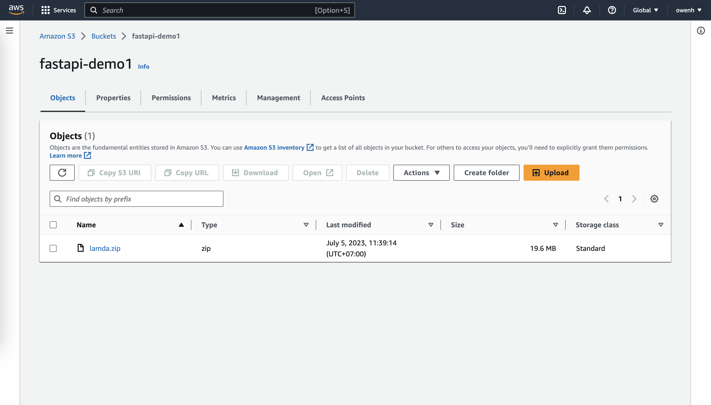

# Contributing Guidelines

## Setting up a development environment

The following instructions apply for Python.
Require install Python

### How to run

#### Create Environment

```sh
python -m venv *path*
```
or 
```sh
python3 -m venv *path*
```

#### Activate Environment

```sh
source */bin/activate # For Linux or Mac OS X users
.\Scripts\activate      # For Windows PowerShell Users
```

#### Deactivate Environment
```sh
deactivate
```

#### Run pipfile
``````sh
pipenv shell   # activate virtual enviroment if not activated yet
pipenv update --dev    # update all dependencies in Pipfile (including dev ones). This will also generate the lock file which is used by pip when installing packages
``````

#### Run Source 

``````sh
flask run     # start the server on localhost port 5000 by default, change it
``````
or 

``````sh
uvicorn main:app --reload    # reload when code changes are made and restarts automatically
``````

### Using Mangum
Mangum is an adapter that allows you to use ASGI applications with API Gateway and Lambda integration seamlessly using Python. It provides support for both HTTP APIs (API Gateway V1), and RESTful web services (API Gateway V2).
#### Import and Using Mangum

Firstly install mangum using following commands:
```sh
pip install mangum
```
or 
```sh
pip3 install mangum
```

After installation completed successfully then import required libraries as follows :
```python
...
from fastapi import FastAPI
from mangum import Mangum

app = FastAPI()
...

handler = Mangum(app)
```


### How to zip source

To Zip library of project, run command by terminal
```
cd *environment path*/liv/*Python version*/site-packages; zip -r lamda.zip .
```

then move `lamda.zip` to the root of folder, and run command in terminal to add other files or folders.
```
zip -g lamda.zip -r *folder or file name*
```

### Upload Zip source to AWS S3

Go to [Amazon S3](https://s3.console.aws.amazon.com/s3)

If don't have any bucket, create a new one.
Then go to bucket and upload `lamda.zip`.


### Create RestAPI on AWS by severless method.

Go to [Amazon Lamda Control Panel](https://console.aws.amazon.com/lambda)

If don't have any function, Click `Create a function` to start.


1. Name your Lambda Function (e.g., "fastApi")
2. Choose runtime Python 3.10 for example from dropdown list. 
If you want use different python versions please choose it accordingly.
3. Choose Architecture
4. Set Timeout value
5. Add Environment Variables if needed
6. Select Role which has permission access to resources like s3 buckets etc..
7. After create function, under code editor select 'Upload from Amazon S3 location' option and browse uploaded lambda package on Amazon.
8. At `Runtime setting`, select `Edit` and change `Handler` by path of handler of Mangum:
For Example in case of Flask based project the Handler would be in file `main` of folder `app` and its name is `handler`
the path is `app.main.handler`.

9. At `Function Overview`, click `Add trigger` and choose `API gateway`, then choose `Create a new api` and `Rest Api` at API type.

9. Test Your Code
You can test your API endpoint using tools such as Postman or curl commands:
````curl --location --request GET '<your_api_gateway>/dev/' \
--header 'Content-Type: application/json' \
--data-raw '{
    "name": "<NAME>",
    "age" :  30
    }'
````

This will trigger an execution of your fastAPI app with sample data provided
You should get response similar to this
    ```{"message":"Hello World!"}```
If everything is working fine then congratulations!!
Now we are ready to deploy our FastAPI App


